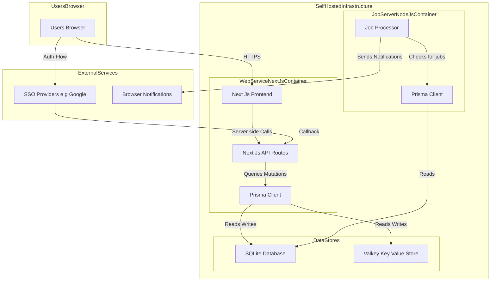

# Self-Hosted Organizer Repository Guide for OpenHands Microagents

This document provides a comprehensive overview of the Self-Hosted Organizer project, designed for OpenHands microagents to navigate, understand, and autonomously modify the codebase. It consolidates the full architecture from `docs/architecture/`, enabling agents to perform tasks like adding features, fixing bugs, or extending functionality while maintaining consistency.

## Project Overview

This document outlines the complete fullstack architecture for the Self-Hosted Organizer, including the backend systems, frontend implementation, and their integration. It serves as the single source of truth for AI-driven development, ensuring consistency across the entire technology stack. This unified approach combines what would traditionally be separate backend and frontend architecture documents, streamlining the development process.

**Starter Template or Existing Project**  
N/A - This is a greenfield project. The architecture will be designed from scratch based on the technology stack defined in the PRD, without the use of an external starter template.

**Change Log**  
| Date | Version | Description | Author |  
| :---- | :---- | :---- | :---- |  
| 2025-09-05 | 1.0 | Initial Architecture Draft | Winston |

## Tech Stack

| Category | Technology | Version | Notes |  
| :--- | :--- | :--- | :--- |  
| **Frontend Framework** | Next.js | ~14.2.0 | App Router, React Server Components |  
| **UI Library** | React | ~18.3.0 | |  
| **Styling** | Tailwind CSS | ~3.4.0 | Utility-first CSS framework |  
| **Authentication** | NextAuth.js | ~5.0.0 | Handles SSO and session management |  
| **Backend Framework**| Next.js API Routes | ~14.2.0 | For all backend endpoints |  
| **ORM** | Prisma | ~5.15.0 | Database toolkit for TypeScript |  
| **Relational Database**| SQLite | | Default for local development |  
| **Key-Value Store** | Valkey | | For caching and session data |  
| **Testing** | Jest | ~29.7.0 | Test runner |  
| **Testing Library** | React Testing Library| ~16.0.0 | For component testing |  
| **Containerization** | Docker | | For creating portable environments |  
| **Orchestration** | Docker Compose | | For local multi-container setup |  

For more details on coding conventions and styling, see the [Coding Standards](#coding-standards) section.

## Repository Structure

This outlines the source tree for the Self-Hosted Organizer monorepo.

```
/
├── apps/
│   ├── web/
│   │   ├── src/
│   │   │   ├── app/
│   │   │   ├── components/
│   │   │   └── lib/
│   │   ├── next.config.js
│   │   └── package.json
│   └── jobs/
│       ├── src/
│       └── package.json
├── packages/
│   ├── db/
│   │   ├── prisma/
│   │   │   └── schema.prisma
│   │   └── package.json
│   └── ui/
│       ├── src/
│       └── package.json
└── package.json
```

### Key Directories
- **`apps/web`**: The main Next.js application, containing all UI and API routes.
- **`apps/jobs`**: The independent job server for background tasks.
- **`packages/db`**: The shared Prisma package for database access.
- **`packages/ui`**: A shared component library (optional, for future use).

For microagents: Entry points are `apps/web/src/app/page.tsx` for UI and `apps/web/src/app/api/` for backend. Shared logic in `packages/`. Use npm workspaces for dependencies.

## High-Level Architecture

**Technical Summary**  
The architecture is designed as a containerized, two-service system within a unified monorepo. The primary service is a fullstack Next.js application that handles all user interactions, rendering the UI and providing a backend API. The secondary, independent service is a job server dedicated to processing background tasks like notifications. Data persistence is managed by Prisma, using a hybrid approach of SQLite for relational data and Valkey for key-value storage, with a core focus on data encryption at rest. This design prioritizes ease of self-hosting, scalability, and a clear separation of concerns between real-time user interactions and asynchronous background processing.

**Platform and Infrastructure Choice**  
- **Platform:** Self-hosted via containers. The primary deployment targets are Docker Compose for simple, single-server setups and Kubernetes for more scalable environments.  
- **Key Services:**  
  - **Containerization:** Docker will be used to package the Next.js web app and the job server into portable images.  
  - **Orchestration:** Docker Compose will be the default for local development and basic deployments.  

**Repository Structure**  
- **Structure:** Monorepo.  
- **Tooling:** Standard npm workspaces.  

**High-Level Architecture Diagram**



**Architectural and Design Patterns**  
- **Two-Service Model:** Separating the user-facing web application from the background job processor.  
- **Monorepo:** Using a single repository to manage both services and shared code.  
- **Repository Pattern:** Implemented via Prisma to abstract all data access logic.  
- **Containerization:** Using Docker to ensure environment consistency and simplify deployment.

For microagents: Modify UI in `apps/web/src/components/`, API in `apps/web/src/app/api/`, jobs in `apps/jobs/src/`. Update schema in `packages/db/prisma/schema.prisma` and run migrations.

## Data Models

(For brevity, the Data Models section from the previous step is included here.)  
*Note for agents: Expand with Prisma models as needed; current focus on User, Account, Routine, Task.*

## Database Schema

This is the definitive schema.prisma file that will be located in the packages/db/prisma directory. It defines all tables, fields, and relations for the application.

// packages/db/prisma/schema.prisma

datasource db {
  provider = "sqlite"
  url      = "file:./dev.db"
}

generator client {
  provider = "prisma-client-js"
}

model Account {
  id                String  @id @default(cuid())
  userId            String
  type              String
  provider          String
  providerAccountId String
  refresh_token     String?
  access_token      String?
  expires_at        Int?
  token_type        String?
  scope             String?
  id_token          String?
  user User @relation(fields: [userId], references: [id], onDelete: Cascade)
  @@unique([provider, providerAccountId])
}

model User {
  id        String    @id @default(cuid())
  name      String?
  email     String    @unique
  image     String?
  accounts  Account[]
  routines  Routine[]
}

model Routine {
  id            String   @id @default(cuid())
  name          String
  scheduledTime String
  repeatDays    String   // Stored as a comma-separated string e.g., "MONDAY,TUESDAY"
  userId        String
  user          User     @relation(fields: [userId], references: [id], onDelete: Cascade)
  tasks         Task[]
}

model Task {
  id        String  @id @default(cuid())
  name      String
  duration  Int     // Duration in minutes
  order     Int
  routineId String
  routine   Routine @relation(fields: [routineId], references: [id], onDelete: Cascade)
}

For microagents: Use Prisma Client in `packages/db/` for queries. Run `npx prisma generate` after schema changes.

## API Specification

(For brevity, the OpenAPI Specification from the previous step is included here.)  
*Note for agents: API routes in `apps/web/src/app/api/` (e.g., /api/auth/[...nextauth], /api/routines). Implement new routes following Next.js conventions; protect with auth middleware.*

## Infrastructure and Deployment

The primary method for local development and basic deployment will be Docker Compose.

**docker-compose.yml**

version: '3.8'

services:
  web:
    build:
      context: .
      dockerfile: ./apps/web/Dockerfile
    ports:
      - '3000:3000'
    volumes:
      - .:/app
    environment:
      - DATABASE_URL=file:/app/packages/db/prisma/dev.db
      - NEXTAUTH_URL=http://localhost:3000
      - NEXTAUTH_SECRET= # GENERATE a secret for this
      # Add other SSO provider secrets here
    networks:
      - app-network
  jobs:
    build:
      context: .
      dockerfile: ./apps/jobs/Dockerfile
    volumes:
      - .:/app
    environment:
      - DATABASE_URL=file:/app/packages/db/prisma/dev.db
    depends_on:
      - web
    networks:
      - app-network

networks:
  app-network:
    driver: bridge

For microagents: Build with `docker compose up --build`. Environment vars in .env; avoid hardcoding secrets.

## Security

- **Authentication:** Handled by NextAuth.js, which provides CSRF protection, secure cookie management, and standard OAuth 2.0 flows.  
- **Authorization:** All API endpoints must be protected and will only operate on data owned by the authenticated user, enforced by checking userId in all Prisma queries.  
- **Data Encryption:** The requirement for encryption at rest will be fulfilled by filesystem-level encryption on the host server. The application logic does not need to handle encryption itself.  
- **Secrets Management:** All secrets (database URLs, NEXTAUTH_SECRET, SSO provider keys) must be managed via environment variables and never hardcoded.

For microagents: Always validate user ownership in queries (e.g., `where: { userId: session.user.id }`). Use secure env vars.

## Coding Standards

This document outlines the coding standards and conventions to be followed for the Self-Hosted Organizer project.

### Styling Strategy

To maintain a clean, consistent, and maintainable codebase, this project will use **Tailwind CSS** as its primary styling methodology.

#### Rationale
- **Utility-First:** Tailwind's utility-first approach allows for rapid UI development without writing custom CSS.  
- **Consistency:** It enforces a consistent design system by using a predefined set of utilities.  
- **Performance:** It can produce highly optimized, small CSS files by purging unused styles.  
- **Minimalism:** Aligns with the project's goal of a clean and minimalist user interface.  

#### Implementation
- All new components should be styled directly in the JSX using Tailwind classes.  
- Custom CSS should be avoided. If a component requires complex styling that cannot be achieved with utilities, create a component-specific CSS module.  
- Use the `@apply` directive sparingly and only for reusable component classes.

### General Coding Guidelines
- Use TypeScript for type safety.  
- Follow DRY principles; extract shared logic to `packages/`.  
- Write tests for new features using Jest and React Testing Library.  
- Commit messages: Conventional Commits (e.g., feat: add routine API).  

For microagents: When modifying code, match existing patterns (e.g., arrow functions, early returns). Analyze files like `apps/web/src/components/` for style consistency before changes.

## Microagents Navigation and Best Practices
- **Key Files to Monitor:** `schema.prisma` for DB changes, `apps/web/src/app/api/` for endpoints, `apps/web/src/components/` for UI.  
- **Workflows:** For new features, update schema -> migrate -> add API route -> update components -> add tests. Run `pnpm turbo run build` to verify.  
- **Tools Integration:** Use Prisma for DB ops, NextAuth for auth checks. Avoid external deps unless in tech stack.  
- **Error Handling:** Use try-catch in async ops; log with console.error for debugging.

This guide ensures microagents can operate effectively. Update as the project evolves.